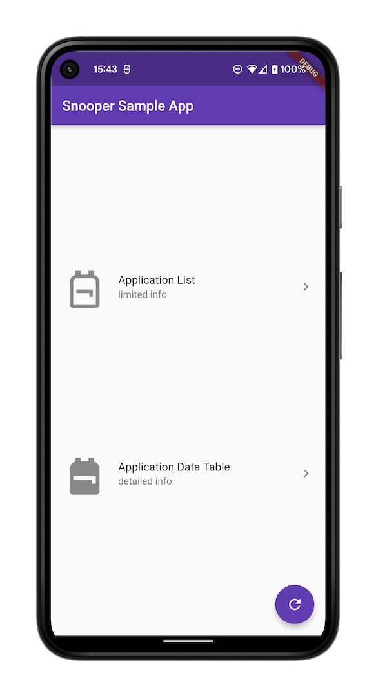
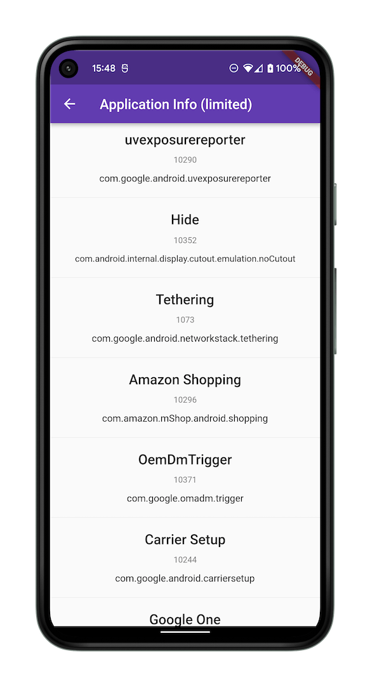
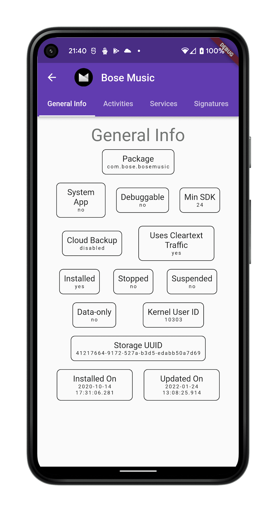
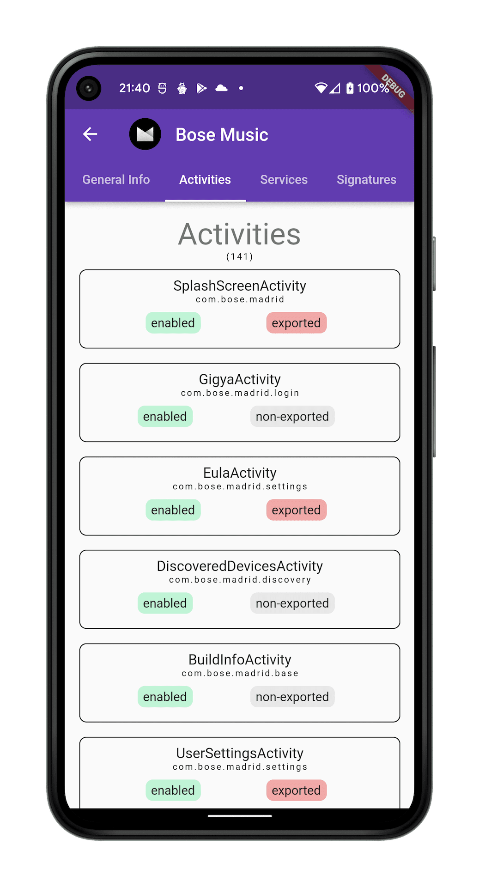
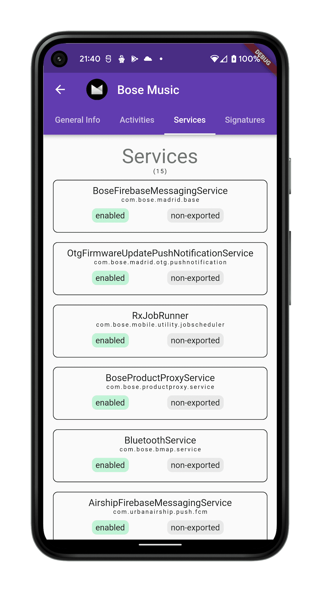
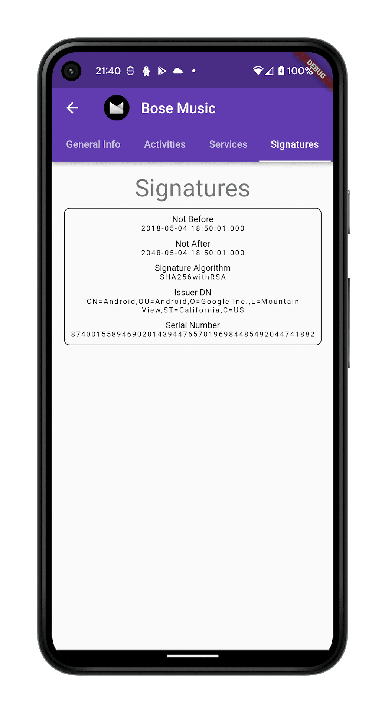
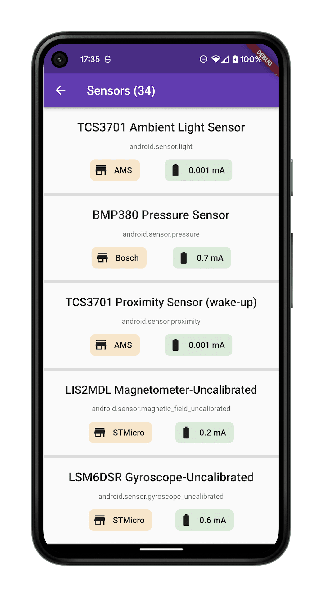

Flutter platform package for Android which provides concrete implementations for various device info
lookups.

### Overview

By using `SnooperAndroid` you can retrieve the following information:

- Simple Device Applications List
- Detailed Device Applications List
    - App icons
    - Activities
    - Services
    - Application Flags (is system app, is debuggable, etc.)
    - APK Signatures
    - Other Metadata
- Sensors List
  
### Specs & Constraints  
Flutter Android plugin embedding version: **V2**  
*Flutter version*: **>=2.5.0**  
*Dart version*: **>=2.17.0-27.0.dev <3.0.0**  
*Dart sound null-safety*: ✅   
*Min Android SDK*: **21**  

### APIs provided by [SnooperAndroid.dart](./lib/snooper_android.dart):
[Simple Package Info](./lib/model/simple_android_package_info.dart):
```dart
List<SimpleAndroidPackageInfo> simplePackages = await SnooperAndroid.simplePackageInfos;
```

[Detailed Package Info](./lib/model/detailed_android_package_info.dart):
```dart
List<DetailedAndroidPackageInfo> detailedPackages = await SnooperAndroid.detailedPackageInfos;
```

[Sensor Info](./lib/model/sensors/sensor_info.dart):
```dart
List<SensorInfo> sensors = await SnooperAndroid.sensorInfos;
```


### Example App
Available at [./example/lib/](./example/lib/)  

<p float="left">
  
  
  
  
  
  
  
  
  
</p>


### Android Permissions
Adding `snooper_android` as a dependency to your project will make the app inherit several permissions.

Any of the permissions can be removed by adding the `tools` namespace and a permission removal tag to your app's `AndroidManifest.xml`, as so:
```xml
<manifest xmlns:tools="http://schemas.android.com/tools">
    <uses-permission android:name="android.permission.QUERY_ALL_PACKAGES" tools:node="remove" />
</manifest>
```

#### Permission list:

<hr>

[QUERY_ALL_PACKAGES](https://developer.android.com/reference/android/Manifest.permission#QUERY_ALL_PACKAGES):
```xml
<uses-permission android:name="android.permission.QUERY_ALL_PACKAGES" />
```

Removing [QUERY_ALL_PACKAGES](https://developer.android.com/reference/android/Manifest.permission#QUERY_ALL_PACKAGES) will result in all user-installed apps disappearing from the results returned by the `SnooperAndroid` APIs.

<hr>

[HIGH_SAMPLING_RATE_SENSORS](https://developer.android.com/reference/android/Manifest.permission#HIGH_SAMPLING_RATE_SENSORS):
```xml
<uses-permission android:name="android.permission.HIGH_SAMPLING_RATE_SENSORS" />
```

Removing [HIGH_SAMPLING_RATE_SENSORS](https://developer.android.com/reference/android/Manifest.permission#HIGH_SAMPLING_RATE_SENSORS) will result in `SnooperAndroid` sensor metadata API to display higher sampling delay values (lesser sampling rates) than otherwise possible to achieve for those sensors.

<hr>