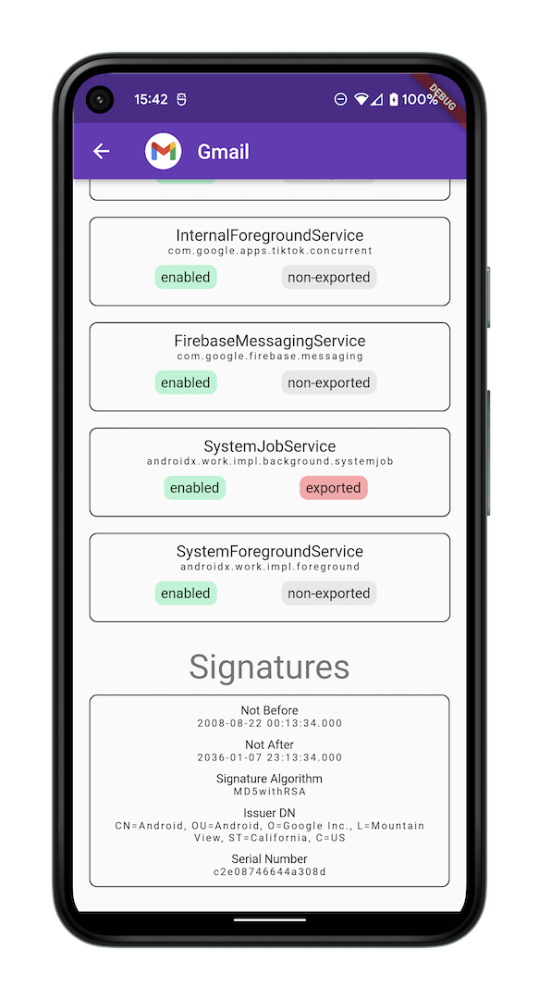

Flutter platform package for Android which provides concrete implementations for various device info
lookups.

By using `SnooperAndroid` you can retrieve the following information:

- Simple Device Applications List
- Detailed Device Applications List
    - App icons
    - Activities
    - Services
    - APK Signatures
    - Other Metadata

### APIs provided by [SnooperAndroid.dart](./lib/snooper_android.dart):
[Simple Package Info](./lib/model/simple_android_package_info.dart):
```dart
List<SimpleAndroidPackageInfo> simplePackageInfos = await SnooperAndroid.simplePackageInfos;
```

[Detailed Package Info](./lib/model/detailed_android_package_info.dart):
```dart
List<DetailedAndroidPackageInfo> detailedPackageInfos = await SnooperAndroid.detailedPackageInfos;
```


### Example App
Available at [./example/lib/](./example/lib/)  

<p float="left">
  
  
  
  
</p>


### Android Permissions
Adding `snooper_android` as a dependency to your project will make the app inherit the [QUERY_ALL_PACKAGES](https://developer.android.com/reference/android/Manifest.permission#QUERY_ALL_PACKAGES)
permission:
```xml
<uses-permission android:name="android.permission.QUERY_ALL_PACKAGES" />
```
which can be verified in the app's merged manifest.

It can be removed by adding the `tools` namespace and a permission removal tag to your app's `AndroidManifest.xml`:
```xml
<manifest xmlns:tools="http://schemas.android.com/tools">
    <uses-permission android:name="android.permission.QUERY_ALL_PACKAGES" tools:node="remove" />
</manifest>
```

Removing [QUERY_ALL_PACKAGES](https://developer.android.com/reference/android/Manifest.permission#QUERY_ALL_PACKAGES) will result in all user-installed apps disappearing from the results returned by the `SnooperAndroid` APIs.